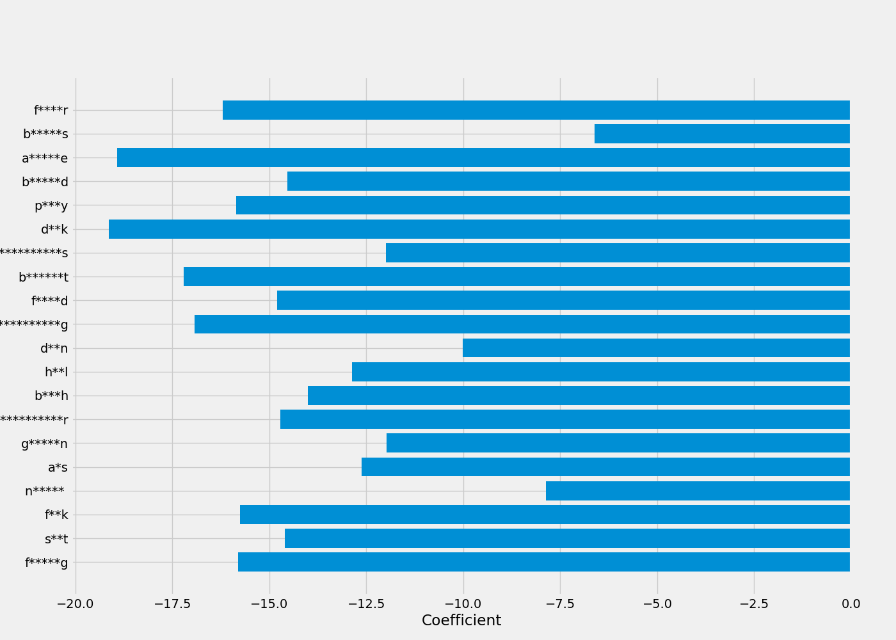

```{r setup, include=FALSE}
knitr::opts_chunk$set(echo = TRUE)
library(reticulate)
library(knitr)
library(ggfortify)
use_python("/home/spencer/anaconda3/bin/python")
image_path <- "images/"
data_path <- "data/"
figure_path <- "figures/"
```

# Why are Python and R So Widely Used?

Data Science is one of the most sought after set of skills right now, and is only getting more and more popular.  According to IBM, the number of jobs for all US Data Professionals will increase to 2,720,000, and the average pay for Data Scientists and Data Engineers is over $100,000.[^1] It is easy to see why many colleges are starting to build programs specifically for Data Science  - such as Siena! - in order to prepare students for this field more effectively.  Skills like machine learning, data visualization, and statistics are extremely in demand, and won't be going away anytime soon, so learning how to program and use these skills is highly valuable.  

](images/most_popular_data_science.png)

As shown in the image above, **Python** and **R** are two of the most used programming languages in the Data Science community - ranked first and third respecitively in popularity.  However, depending on where/how students learn to program, they may experience overexposure to one or the other, and not have as widely available of a skill set.  This has been my personal experience at Siena - while I've had much experience using Python, I've had very little using R.

## R
```{r  out.width = "20%",echo=F}
include_graphics(paste(image_path,sep='',"Rlogo.png")) 
```

Released in August of 1993, R quickly became one of the most used programming languages for statisticians due to its simplicity, wide array of statistical functions, and open-source availability.  Another one of its perks is how easy it is to load in datasets to R to visualize and quantify data.  The barebones of R (RBase) contains much of these statistical functions, as well as some basic plotting functions.  Using packages such as **ggplot2** to enhance visualizations  brings out the best in R.  

### RStudio
```{r  out.width = "20%",echo=F}
include_graphics(paste(image_path, sep='', "rstudio_logo.png")) 
```

The most popular IDE for R is RStudio.  RStudio is equipped with a space for editing scripts, a console for running single lines of code, area to display plots and help, a workspace for created variables, and much more.  While RStudio has a free version, there are premium versions available to the general public, as well as commerical liscensing.  RStudio is also used for **RMarkdown** files, which we will talk more about later on.

## Python

```{r  out.width = "20%",echo=F}
include_graphics(paste(image_path, sep='', "python_logo.png")) 
```

Released in 1991, Python is a general purpose, object-oriented language.  Python is noted as being one of the easiest languages to learn for newcomers to programming due to its high level of readability.  In recent years, Python has experienced an explosion in its use, especially in Data Science, due to its vast number of libraries, great documentation, and the increasingly large community of people who use Python.  As of the time this was written, Python has become the second most popular programming language amongst **all** programmers, even those who aren't Data Scientists, meaning Python is even more valuable to have as a skill.

### Juptyer and Google Colab
```{r  out.width = "20%",echo=F}
include_graphics(paste(image_path, sep='', c("jupyter_logo.png","colab_logo.png")))
```

Similar to RStudio for R users, Jupyter Notebook - and more recently Jupyter-Lab - are the most popular IDEs for Python users.  These programs create an **IPython Notebook**, which can contain chunks of Python code, plots, and markdown text.  Recently, Google has been working to make Jupyter Notebooks accessible via Google Drive, a project known as **Google Colab**.  These notebooks can be shared the same way a Google Document can be shared with multiple users.  They are able to access data files from Google Drive, as well as locally stored files, can be pushed/pulled from Github just like regular Jupyter Notebooks are, and run just as fast as regular Jupyter Notebooks!.  This cloud accessibility, along with the number of tutorials and code snippets on Google Colab make it one of the best Data Science tools available.

# Why Choose? Can't We Have Both?
```{r  out.width = "20%",echo=F}
include_graphics(paste(image_path, sep='', "reticulated_python.png"))
```

Both Python and R offer packages to support this integration, but R's integration is much better, and is the one we will focus on.  Using the package **reticulate**, we can easily integrate Python code with R using Rmarkdown files (.Rmd).  

## Installation

1. The following software needs to be installed in order to use ***reticulate***.

* Python (3.7 or higher recommended)
  + [Using Anaconda](https://docs.anaconda.com/anaconda/install/)
  + [Without Anaconda](https://realpython.com/installing-python/)
* [R](https://cran.cnr.berkeley.edu/) (3.6.1 recommended)
* [RStudio](https://rstudio.com/products/rstudio/#rstudio-desktop)

2. From the *Console* on RStudio, run the following command to install **reticulate**.

```{r, eval=F}
install.packages("reticulate")
```

## How to Use

The first step is to link the .Rmd file to the location where Python is installed.

If you don't know the path which Python is installed under, do the following:

* Open the Python shell.
* Run the following commands in the shell, and the location will be displayed.

```{python, eval=F}
import os
import sys
os.path.dirname(sys.executable)
```

From there, run the following chunk of code in the .Rmd file.

```{r, eval=F}
library(reticulate)
use_python("PATH/TO/PYTHON")
```

And now you can run Python code in an RMarkdown file!  When declaring code chunks, instead of using `{r,include=T}`, use `{python,include=T}` to run a chunk of Python code instead of R code.  To download packages for Python, use the command `py_install{"PACKAGE_NAME"}`.  

# Python & R Together in Action
While we could go through everything in R and replicate it with Python code, this is kind of pointless.  For statistics, R's pre-imported functions are much easier to use than in Python, and it makes more sense to use R for this.  Visualizations can be made with both, and depending on the visualization you want to create, either R or Python would be appropriate.  For machine learning and web scraping, it makes more sense to use Python than R.  Data cleansing is also very efficient in Python, and one of the biggest criticisms of R is the difficulty of importing/exporting data.  Therefore, the best thing to do would be to see both in action together in a project, rather than trying to compare the two.

## Quentin Tarantino


Quentin Tarantino is one of the most successful film directors of all time. *Pulp Fiction* is one of the top 10 films of all time.  *Resevoir Dogs*, *Jackie Brown*, *Django: Unchained*, *Inglorious Basterds*, and *Once Upon a Time... In Hollywood* are all critically acclaimed as well, and *Kill Bill Vol. 1 & 2* is one of the most badass movies ever created.  Amongst other things, there are two very noticeable features about Tarantino's films: **a lot** of curse words, and **a lot** of deaths.  *Pulp Fiction* alone had almost 470 curse words, and over the course of both *Kill Bill* films, there are 74 total on-screen deaths.  This proposes an obvious question - Is there a relationship between the number of curse words and number of deaths?  We can use both Python and R to prove/disprove this relationship.

First we import the necessary Python libraries for our mini-project.
```{python, include=T}
import pandas as pd # library used to create Dataframes in Python
from pandasql import sqldf # used to query Dataframes using SQL 
pysqldf = lambda q: sqldf(q, globals()) 
import numpy as np # useful mathematical library in Python

import matplotlib.pyplot as plt # basic plotting library in Python
plt.style.use('fivethirtyeight') # more visually appealing than the default
import seaborn as sns # higher level plotting library, built on-top of matplotlib

import warnings
warnings.filterwarnings('ignore')

data_path = 'data/' # path to where data files are storred
```

We can now import the data, and add a few variables to the data set.

```{python, include=T}
tino = pd.read_csv(data_path+'tarantino.csv') # imports the .csv file
tino['primary_key'] = tino.index # creates a new variable called 'primary_key', that is equal to the index of the data set.  We could access the index column on its own, but it makes things easier for querying
tino['type_count'] = tino.groupby(['movie','type']).cumcount()+1 # creates a new variable that gets the number of deaths/curse words up to the current minute mark of the film

# The following two lines of code use SQL to query the files.
word = pysqldf("SELECT * FROM tino WHERE type='word'") # get all instances of a curse word being said
death = pysqldf("SELECT * FROM tino WHERE type='death'") # get all instances of a death occuring
movies = tino.movie.unique() # get a list with the names of all of the movies in this data set

# Preview the Data
death.head() # the entire data set is contained in tino, but to keep this as clean as possible, it is easier to show instances where no curse word is present
```

Python's visualization tools are great, and we can use them to explore the data even further.  Below are the most used curse words in Tarantino films.

```{python, include=T}
tino['word'].value_counts()[:7].plot.barh(figsize=(16,10)) # the .value_counts() method counts the number of instances each word appears.  Using [:7] gets us the 7 most frequently occuring words.  Pandas has a .plot method to plot directly from the dataframe.  We specify a horizontal barplot (barh), and specify the figure size
plt.gca().invert_yaxis() # Change order from ascending to descending
plt.title("Most Common Curse Words in Tarrentino Films") # Add title
locs, labels = plt.yticks(); # Get locations and current labels for the y_ticks so we can sensor them
plt.yticks(locs,["F***ing","Sh**","F***","N-word","A**","Goddamn","Motherf*****"]); # Maps the uncensored words to their censored spelling
plt.xlabel("# of Instances"); # Label the x-axis
```

We can also see the rate at which curse words occur vs. the rate at which deaths occur in each film.

```{python, include=T}
f, axes = plt.subplots(1,2,figsize=(16,10)) # set up a set of two subplots
sns.despine(left=True) # reduces dimension to 1 for choosing which axis to plot to

sns.lineplot(data=word,x='minutes_in',y='type_count',hue='movie',ax=axes[0]) # creates a time_series plot of curse words, colored by film
axes[0].set_xlabel("Minutes into the Film"); # label cooresponding x-axis
axes[0].set_ylabel("# of Curse Words"); # label cooresponding y-axis
axes[0].set_title("Rate of Cursing") # label cooresponding title

sns.lineplot(data=death,x='minutes_in',y='type_count',hue='movie',ax=axes[1]) # creates a time_series plot of deaths, colored by film
axes[1].set_xlabel("Minutes into the Film") # label cooresponding x-axis
axes[1].set_ylabel("# of Deaths"); # label cooresponding y-axis
axes[1].set_title("Death Rate"); # label cooresponding title
```

From these plots it seems plausible that there may be an anti-coorelation in the data.  Meaning that the more curse words are present, there are actually **less** deaths in the film.  We can use Principle Component Analysis, as well as Linear Regression to see if there is any clear relationship between the two.  We can "dumify" the curse words used in the film, and see which ones have the greatest feature importance when targeting total deaths in the movies.  For the purpose of this analysis we will only look at the 20 most commonly used curse words, as Tarantino has managed to incorporate over 100 different curse words into his films - impressive.

```{python, eval=F}
tino['death_count'] = tino['type_count'].where(tino['type']=='death') # insert running death count at "death markers".  This is going to become our target variable.
for i in range(len(tino)): 
    if tino.iloc[i]['type']=='word' and tino.iloc[i]['type_count']==1: # mark the start of each new film with 0 deaths
        tino.set_value(i, 'death_count', 0);

tino['death_count'] = tino['death_count'].fillna(method='ffill') # forward fill method for NaN values - if a value is NaN (i.e. a word was said) replace it with the previous entry


top_20 = tino['word'].value_counts()[:20].index # top 20 curse words in his films

dumified_words = pd.get_dummies(tino['word']) # gives each word their own column: a 1 signifies this word was used, a 0 otherwise
tino[top_20] = dumified_words[top_20] # take the top 20 words and give them their own column in the main dataframe

tino = tino.drop(columns=['word','type','primary_key','type_count']) # we no longer need these columns, so we can drop them 
tino.to_csv(data_path+"tino_for_R.csv",index=False) # write to .csv file
```

<!-- The below section actually runs the code and is hidden due to output errors :/ -->
```{python, include=F}
tino['death_count'] = tino['type_count'].where(tino['type']=='death') # insert running death count at "death markers".  This is going to become our target variable.
for i in range(len(tino)): 
    if tino.iloc[i]['type']=='word' and tino.iloc[i]['type_count']==1: # mark the start of each new film with 0 deaths
        tino.set_value(i, 'death_count', 0);

tino['death_count'] = tino['death_count'].fillna(method='ffill') # forward fill method for NaN values - if a value is NaN (i.e. a word was said) replace it with the previous entry

top_20 = tino['word'].value_counts()[:20].index # top 20 curse words in his films

dumified_words = pd.get_dummies(tino['word']) # gives each word their own column: a 1 signifies this word was used, a 0 otherwise
tino[top_20] = dumified_words[top_20] # take the top 20 words and give them their own column in the main dataframe

tino = tino.drop(columns=['word','type','primary_key','type_count']) # we no longer need these columns, so we can drop them 
tino.to_csv(data_path+"tino_for_R.csv",index=False) # write to .csv file
```

PCA is much easier to do in R than in Python, so we can create a biplot from the Data here.

```{r, include=T}
tino <- read.csv(paste(data_path,sep='',"tino_for_R.csv")) # load the dataframe into an R-understood variable

# we must scale the data to make sure variance is on same scale
scaled.tino <- scale(tino[c(2:23)])

autoplot(prcomp(scaled.tino), data = tino, colour = 'movie',loadings = TRUE, loadings.label = TRUE) # description at https://cran.r-project.org/web/packages/ggfortify/vignettes/plot_pca.html
```

From the PCA biplot, we can see that one principle component aligns with the more common curse words, and the other seems to align with `minutes_in` and `death_count`.  However, each principle component only seems to describe <10% of the data - this is not good.  This is an indicator we are not going to find a relationship between the two.

We can try to create a regression model to see if there is a significant relationship between these variables.  Python would be best suited for this task.

```{python, include=T}
from sklearn.linear_model import LinearRegression
from sklearn.model_selection import train_test_split

X = tino

# Drop columns not being used
X = X.drop(columns=['movie','minutes_in','death_count'])
target = tino['death_count']

X_train, X_test, y_train, y_test = train_test_split(X.fillna(-999), target, train_size = 0.75, random_state=1) 
# Create linear regression object. 
reg = LinearRegression() 

# Train the model using the training sets.
reg.fit(X_train, y_train);

print(reg.score(X_train, y_train)) ## R^2 value

```

This is a relatively low r^2^ value, which means that our model can only predict a small amount of variance based on the number of curse words per movie.  We can try to look at the feature importance of each variable as well, and see if this shows us anything.

```{python, eval=F}
f, axes = plt.subplots(figsize=(14,10))

pos = np.arange(len(reg.coef_)) # for yticks
coef = reg.coef_ # get the coefficients
col_names = X.columns.values # get column names for feature importance
plt.barh(pos,coef) # plot feature importance 
plt.yticks(pos,[x[0]+"*"*(len(x)-2)+x[-1] for x in col_names]); # censor words
plt.xlabel("Coefficient")
plt.savefig("images/coef.png")
```


Here it can also be seen that no single word has a major impact on the total number of deaths, and we can determine that there is no direct relationship between deaths and curse words in Quentin Tarantino films.

# Conclusion
While in my example I only used R to conduct PCA, there are plenty more applications that R would've been very useful for.  Had it been appropriate to apply T-Test, Chi-Squared Test, get a p-value, etc, then R would've been my language of choice in doing so. 

<!--Footnotes-->
[^1]: [Forbes: "IBM Predicts Demand For Data Scientists Will Soar 28% By 2020"](https://www.forbes.com/sites/louiscolumbus/2017/05/13/ibm-predicts-demand-for-data-scientists-will-soar-28-by-2020/#2262aec17e3b)