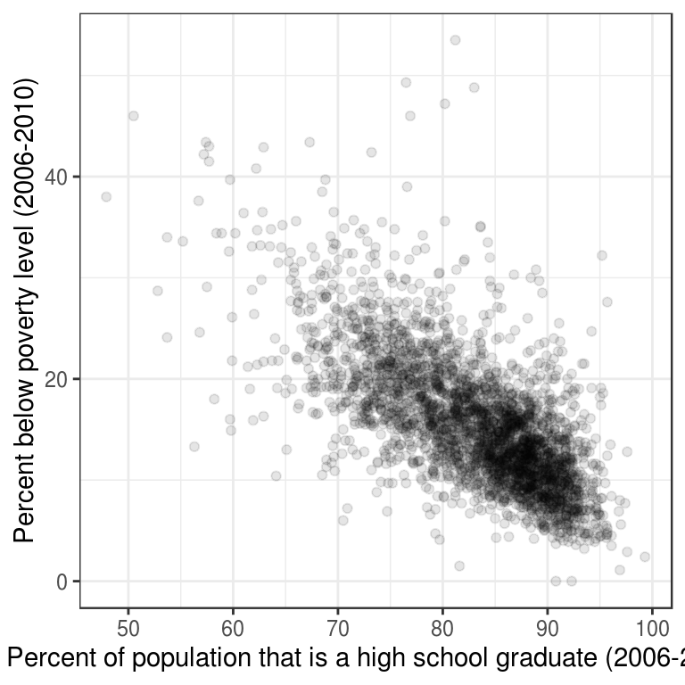
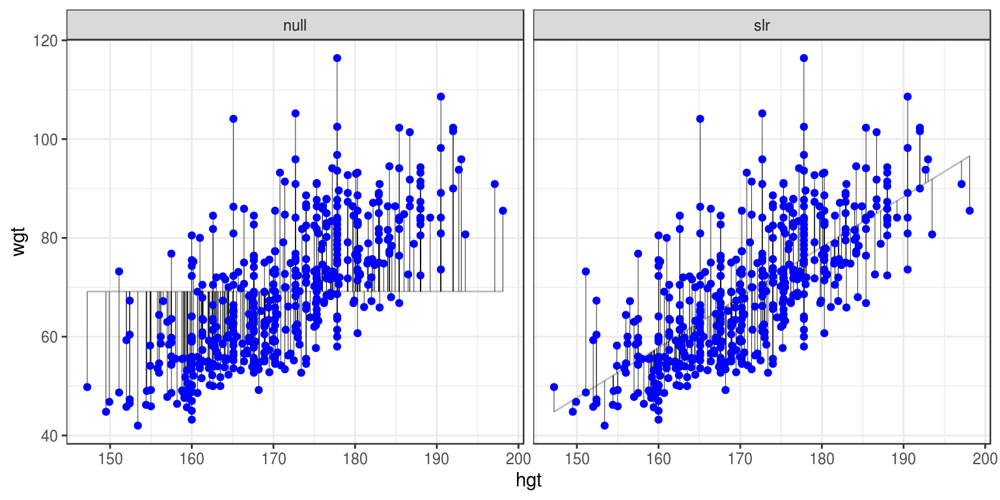

```{r setup, include=FALSE}
knitr::opts_chunk$set(echo = TRUE)
library(openintro)
library(dplyr)
library(DT)
library(ggplot2)
library(gridExtra)
library(broom)
```

# Introduction/PreReqs


This material is from the DataCamp course Correlation and Regression by Ben Baumer. Before using this material, the reader should have completed and be comfortable with the material in the DataCamp modules Introduction to R, Introduction to Data, and Exploratory Data Analysis.
Reminder to self: each `*.Rmd` file contains one and only one chapter, and a chapter is defined by the first-level heading `#`.

# Visualizing Two Variables
This chapter details techniques for exploring bivariate relationships.

## ScatterPlots

Scatterplots are the most common and effective tools for visualizing the relationship between two numeric variables.

The `ncbirths` dataset is a random sample of 1,000 cases taken from a larger dataset collected in 2004. Each case describes the birth of a single child born in North Carolina, along with various characteristics of the child (e.g. birth weight, length of gestation, etc.), the child’s mother (e.g. age, weight gained during pregnancy, smoking habits, etc.) and the child’s father (e.g. age). You can view the help file for these data by running `?ncbirths` in the console.

```{r,echo=F}
DT::datatable(ncbirths)
```

### Exercise
Using the `ncbirths` dataset, make a scatterplot using `ggplot()` to illustrate how the birth weight of these babies varies according to the number of weeks of gestation.

```{r,echo=F}
ggplot(data=ncbirths, aes(y=weight, x=weeks)) +
  geom_point(alpha=0.2) +
  theme_bw()
```

## Boxplots as Discretized/Conditioned Scatterplots
If it is helpful, you can think of boxplots as scatterplots for which the variable on the x-axis has been discretized.

The `cut()` function takes two arguments: the continuous variable you want to discretize and the number of `breaks` that you want to make in that continuous variable in order to discretize it.

### Exercise
Using the `ncbirths` dataset again, make a boxplot illustrating how the birth weight of these babies varies according to the number of weeks of gestation. This time, use the `cut()` function to discretize the x-variable into six intervals (i.e. five breaks).

```{r,echo=F}
# Weight v. Weeks
ggplot(data = ncbirths, 
       aes(x = cut(weeks, breaks = 5), y = weight)) + 
       geom_boxplot() + 
       theme_bw()
```

## Creating Scatterplots

Creating scatterplots is simple and they are so useful that is it worthwhile to expose yourself to many examples. Over time, you will gain familiarity with the types of patterns that you see. You will begin to recognize how scatterplots can reveal the nature of the relationship between two variables.

In this exercise, and throughout this chapter, we will be using several datasets listed below. These data are available through the `openintro` package. Briefly:

* The `mammals` dataset contains information about 39 different species of mammals, including their body weight, brain weight, gestation time, and a few other variables.

* The `mlbBat10` dataset contains batting statistics for 1,199 Major League Baseball players during the 2010 season.

* The `bdims` dataset contains body girth and skeletal diameter measurements for 507 physically active individuals.

* The `smoking` dataset contains information on the smoking habits of 1,691 citizens of the United Kingdom.

### Exercise
* Using the `mammals` dataset, create a scatterplot illustrating how the brain weight of a mammal varies as a function of its body weight.

```{r, echo=F}
ggplot(data = mammals, aes(y = BrainWt, x = BodyWt)) +
  geom_point() + 
  theme_bw() + 
  labs(x = "Body Weight (kg)", y = "Brain weight (kg)")
```

* Using the `mlbBat10` dataset, create a scatterplot illustrating how the slugging percentage (SLG) of a player varies as a function of his on-base percentage (OBP).

```{r, echo=F}
p1 <- ggplot(data=mlbBat10, aes(x=OBP,y=SLG)) + 
  geom_point(alpha=0.10) + 
  theme_bw() + 
  labs(y="Slugging % (TB/AB)",x="On Base %")
p1
```

* Using the `bdims` dataset, create a scatterplot illustrating how a person’s weight varies as a function of their height. Use color to separate by sex, which you’ll need to coerce to a factor with `factor()`.

```{r,echo=F}
p3 <- ggplot(data = bdims, aes(y = wgt, x= hgt, color = factor(sex))) + 
  geom_point() + 
  theme_bw() + 
  labs(y = "Weight (kg)", x = "Height (cm)")
p3
```

* Using the `smoking` dataset, create a scatterplot illustrating how the amount that a person smokes on weekdays varies as a function of their age.

```{r,echo=F}
ggplot(data = smoking, aes(y = amtWeekdays, x = age)) + 
  geom_point(alpha = 0.2) + 
  theme_bw() + 
  labs(x = "Age", y = "Number of cigarettes smoked per day on weekdays")
```

### Characterizing Scatterplots
The following figure shows the relationship between the poverty rates and high school graduation rates of counties in the United States.


## Transformations
The relationship between two variables may not be linear. In these cases we can sometimes see strange and even inscrutable patterns in a scatterplot of the data. Sometimes there really is no meaningful relationship between the two variables. Other times, a careful transformation of one or both of the variables can reveal a clear relationship.

Recall the bizarre pattern that you saw in the scatterplot between brain weight and body weight among mammals in a previous exercise. Can we use transformations to clarify this relationship?

`ggplot2` provides several different mechanisms for viewing transformed relationships. The `coord_trans()` function transforms the coordinates of the plot. Alternatively, the `scale_x_log10()` and `scale_y_log10()` functions perform a base-10 log transformation of each axis. Note the differences in the appearance of the axes.

### Exercise

The `mammals` dataset is available in your workspace.

* Use `coord_trans()` to create a scatterplot showing how a mammal’s brain weight varies as a function of its body weight, where both the x and y axes are on a `"log10"` scale.

```{r,echo=F}
ggplot(data = mammals, aes(y = BrainWt, x = BodyWt)) + 
  geom_point() + 
  coord_trans(x = "log10", y = "log10") + 
  theme_bw() +
  labs(x = "Total body weight of the mammal (in kg)",
       y = "Brain weight of the mammal (in kg)")
```

* Use `scale_x_log10()` and `scale_y_log10()` to achieve the same effect but with different axis labels and grid lines.  

```{r,echo=F}
p4 <- ggplot(data = mammals, aes(x = BodyWt, y = BrainWt)) +
  geom_point() +
  scale_x_log10() + 
  scale_y_log10() + 
  theme_bw() + 
  labs(x = "Total body weight of the mammal (in kg)",
       y = "Brain weight of the mammal (in kg)")
p4
```

## Identifying Outliers
In Chapter 6, we will discuss how outliers can affect the results of a linear regression model and how we can deal with them. For now, it is enough to simply identify them and note how the relationship between two variables may change as a result of removing outliers.

Recall that in the baseball example earlier in the chapter, most of the points were clustered in the lower left corner of the plot, making it difficult to see the general pattern of the majority of the data. This difficulty was caused by a few outlying players whose on-base percentages (OBPs) were exceptionally high. These values are present in our dataset only because these players had very few batting opportunities.
Both OBP and SLG are known as rate statistics, since they measure the frequency of certain events (as opposed to their count). In order to compare these rates sensibly, it makes sense to include only players with a reasonable number of opportunities, so that these observed rates have the chance to approach their long-run frequencies.

In Major League Baseball, batters qualify for the batting title only if they have 3.1 plate appearances per game. This translates into roughly 502 plate appearances in a 162-game season. The `mlbBat10` dataset does not include plate appearances as a variable, but we can use at-bats (`AB`) – which constitute a subset of plate appearances – as a proxy.

### Exercise
* Use `filter()` to create a scatterplot for `SLG` as a function of `OBP` among players who had at least 200 at-bats.

```{r, echo=F}
library(dplyr)
# Scatterplot of SLG vs. OBP
ntib <- mlbBat10 %>% 
  filter(AB >= 200)
p2 <- ggplot(data = ntib, aes(y = SLG, x = OBP)) + 
  geom_point() +
  theme_bw()
p2
```

* Find the row of `mlbBat10` corresponding to the one player with at least 200 at-bats whose OBP was below 0.200.

```{r, echo=F}
# Identify the outlying player
mlbBat10 %>% 
  filter(AB >=200, OBP < 0.2)
```

# Correlation

This chapter introduces correlation as a means of quantifying bivariate relationships.

**Understanding Correlation Scale**

In a scientific paper, three correlations are reported with the following values:
* -0.395
* 1.827
* 0.738

The correct interpretation is that 1.827 is **invalid**.

**Understanding Correlation Sign**

In a scientific paper, three correlations are reported with the following values:
* 0.582
* 0.134
* -0.795

**-0.795** represents the strongest correlation.

## Computing Correlation
The `cor(x, y)` function will compute the Pearson product-moment correlation between variables, `x` and `y`. Since this quantity is symmetric with respect to `x` and `y`, it doesn’t matter in which order you put the variables.

At the same time, the `cor()` function is very conservative when it encounters missing data (e.g. `NA`s). The `use` argument allows you to override the default behavior of returning `NA` whenever any of the values encountered is `NA`. Setting the `use` argument to `"pairwise.complete.obs"` allows `cor()` to compute the correlation coefficient for those observations where the values of `x` and `y` are both not missing.

### Exercise
* Use `cor()` to compute the correlation between the birthweight of babies in the `ncbirths` dataset and their mother’s age. There is no missing data in either variable.

```{r,echo=F}
library(openintro)
DT::datatable(ncbirths)

# Compute correlation

ncbirths %>%
  summarize(N = n(), r = cor(weight, mage))
```

* Compute the correlation between the birthweight and the number of weeks of gestation for all non-missing pairs.

```{r,echo=F}
# Compute correlation for all non-missing pairs
ncbirths %>%
  summarize(N = n(), r = cor(weight, weeks, 
                             use = "pairwise.complete.obs"))
```

## Exploring Anscombe
In 1973, Francis Anscombe famously created four datasets with remarkably similar numerical properties, but obviously different graphic relationships. The `Anscombe` dataset contains the `x` and `y` coordinates for these four datasets, along with a grouping variable, `set`, that distinguishes the quartet.

```{r,echo=F}
dat <- datasets::anscombe
Anscombe <- data.frame(
    set  = rep(1:4, each = 11),
    x = unlist(dat[ ,c(1:4)]),
    y = unlist(dat[ ,c(5:8)])
    )
rownames(Anscombe) <- NULL
head(Anscombe)
```

It may be helpful to remind yourself of the graphic relationship by viewing the four scatterplots:

```{r,echo=F}
ggplot(data = Anscombe, aes(x = x, y = y)) +
  geom_point() +
  facet_wrap(~ set) + 
  theme_bw()
```

### Exercise
For each of the four sets of data points in the `Anscombe` dataset, compute the following in the order specified. Don’t worry about naming any of the variables other than the first in your call to `summarize()`.

* Number of observations, `N`
* Mean of `x`
* Standard deviation of `x`
* Mean of `y`
* Standard deviation of `y`
* Correlation coefficient between `x` and `y`

```{r, echo=F}
# Compute properties of Anscombe
Anscombe %>%
  group_by(set) %>%
  summarize(N = n(), mean(x), sd(x), mean(y), sd(y), cor(x, y))
```

**Perception of Correlation**
Recall fig 2.1, which displays the poverty rate of counties in the United States and the high school graduation rate in those counties from the previous chapter. Which of the following values is the correct correlation between poverty rate and high school graduation rate?

* -0.861
* **-0.681**
* -0.186
* 0.186
* 0.681
* 0.861

```{r,echo=F}
library(openintro)
countyComplete %>% 
  summarize(r = cor(poverty, hs_grad)) %>% 
  round(3)
```

Estimating the value of the correlation coefficient between two quantities from their scatterplot can be tricky. Statisticians have shown that people’s perception of the strength of these relationships can be influenced by design choices like the x and y scales.

Nevertheless, with some practice your perception of correlation will improve. Study the four scatterplots in Figure 3.1, each of which you’ve seen in a previous exercise.

```{r,echo=F}
grid.arrange(p1, p2, p3, p4)
```

Starting at the graph in the upper right quadrant and moving counter-clockwise, I estimate the values of correlation to be:

* 0.60
* 0.85
* 0.40
* 0.90

### Exercise
Each graph in the plotting window corresponds to an instruction below. Compute the correlation between…

* `OBP` and `SLG` for all players in the `mlbBat10` dataset.

```{r, echo=F}
# Correlation for all baseball players
mlbBat10 %>% 
  summarize(r = cor(OBP, SLG))
```

* `OBP` and `SLG` for all players in the `mlbBat10` dataset with at least 200 at-bats.

```{r,echo=F}
mlbBat10 %>% 
  filter(AB >= 200) %>% 
  summarize(r = cor(OBP, SLG))
```

* Height and weight for each sex in the `bdims` dataset.

```{r, echo=F}
# Correlation of body dimensions
bdims %>%
  group_by(sex) %>%
  summarize(N = n(), r = cor(hgt, wgt))
```

* Body weight and brain weight for all species of mammals. Alongside this computation, compute the correlation between the same two quantities after taking their natural logarithms.

```{r, echo=F}
# Correlation among mammals, with and without log
mammals %>%
  summarize(N = n(), 
            r = cor(BrainWt, BodyWt), 
            r_log = cor(log(BrainWt), log(BodyWt)))
```

**Interpreting Correlation in Context**
Recall Figure 2.1 where you previously determined the value of the correlation coefficient between the poverty rate of counties in the United States and the high school graduation rate in those counties was -0.681. Choose the correct interpretation of this value.

* **Counties with lower high school graduation rates are likely to have higher poverty rates.**

**Correlation and Causation**

In the San Francisco Bay Area from 1960-1967, the correlation between the birthweight of 1,236 babies and the length of their gestational period was 0.408. Which of the following conclusions is **not** a valid statistical interpretation of these results.

* **Staying in the womb longer causes babies to be heavier when they are born.**

## Spurious Correlation in Random Data
Statisticians must always be skeptical of potentially spurious correlations. Human beings are very good at seeing patterns in data, sometimes when the patterns themselves are actually just random noise. To illustrate how easy it can be to fall into this trap, we will look for patterns in truly random data.
The noise dataset contains 20 sets of `x` and `y` variables drawn at random from a standard normal distribution. Each set, denoted as `z`, has 50 observations of `x`, `y` pairs. Do you see any pairs of variables that might be meaningfully correlated? Are all of the correlation coefficients close to zero?

```{r,include=T}
set.seed(9)
noise <- data.frame(x = rnorm(1000), y = rnorm(1000), z = rep(1:20, 50))
```

* Create a faceted scatterplot that shows the relationship between each of the 20 sets of pairs of random variables `x` and `y`. You will need the `facet_wrap()` function for this.

```{r,echo=F}
# Create faceted scatterplot
ggplot(dat = noise, aes(x= x, y = y)) + 
  geom_point() + 
  facet_wrap(~z) + 
  theme_bw()
```

* Compute the actual correlation between each of the 20 sets of pairs of `x` and `y`. 

```{r,echo=F}
# Compute correlations for each dataset
noise_summary <- noise %>%
  group_by(z) %>%
  summarize(N = n(), spurious_cor = cor(x, y))
noise_summary
```

* Identify the datasets that show non-trivial correlation of greater than 0.2 in absolute value.

```{r,echo=F}
# Isolate sets with correlations above 0.2 in absolute strength
noise_summary %>% 
  filter(abs(spurious_cor) >= 0.2)
```

# Simple Linear Regression
With the notion of correlation under your belt, we’ll now turn our attention to simple linear models in this chapter.

## The "Best Fit" Line
The simple linear regression model for a numeric response as a function of a numeric explanatory variable can be visualized on the corresponding scatterplot by a straight line. This is a “best fit” line that cuts through the data in a way that minimizes the distance between the line and the data points.

We might consider linear regression to be a specific example of a larger class of smooth models. The `geom_smooth()` function allows you to draw such models over a scatterplot of the data itself. This technique is known as visualizing the model in the data space. The method argument to `geom_smooth()` allows you to specify what class of smooth model you want to see. Since we are exploring linear models, we’ll set this argument to the value `"lm"`.

Note that `geom_smooth()` also takes an `se` argument that controls the standard error, which we will ignore for now.

```{r,echo=F}
ggplot(data = bdims, aes(x = hgt, y = wgt)) + 
  geom_point(alpha = 0.33) + 
  geom_smooth(method = "lm", se = FALSE) + 
  theme_bw()
```

## Uniqueness of Least Squares Regression Line
The least squares criterion implies that the slope of the regression line is unique. In practice, the slope is computed by R. In this exercise, you will experiment with trying to find the optimal value for the regression slope for weight as a function of height in the `bdims` dataset via trial-and-error.

### Regression Model Output Terminology
The fitted model for the poverty rate of U.S. counties as a function of high school graduation rate is:

$$\hat{poverty}=64.594−0.591⋅hs\_grad$$

In Hampshire County in western Massachusetts, the high school graduation rate is 92.4%. These two facts imply that the poverty rate in Hampshire County is ___.

```{r,include=T}
64.594 - 0.591 * 92.4
```
So **about 10% expected**.

## Fitted a Linear Model "By Hand"

Recall the simple linear regression model:
$$ Y = b_0 + b_1 X $$
We can find the slope and intercept using basic statistics. 

First, the slope can be defined as 
$$ b_1 = r_{X,Y} \frac{s_Y}{s_X} $$
Where $r_{X,Y}$ represents the correlation `(cor())` of `X` and `Y` and $s_X$ and $s_Y$ represent the standard deviation `(sd())` of `X` and `Y`, respectively.

Secondly, the point $(\bar{x},\bar{y})$ is always on the least squares regression line, where $\bar{x}$ and $\bar{y}$ denote the averages of each.

The `bdims_summary` data frame contains all of the information you need to compute the slope and intercept of the least squares regression line for body weight (`Y`) as a function of height (`X`). You might need to do some algebra to solve for $b_0!$

```{r,include=T}
bdims_summary <- bdims %>%
    summarize(N = n(), r = cor(wgt, hgt), mean_hgt = mean(hgt),
    sd_hgt = sd(hgt), mean_wgt = mean(wgt), sd_wgt = sd(wgt))
bdims_summary 
```

```{r,include=T}
# Add slope and intercept
bdims_summary %>%
  mutate(slope = r*sd_wgt/sd_hgt, 
         intercept = mean_wgt - slope*mean_hgt)
```

## Regression to the Mean

Regression to the mean is a concept attributed to Sir Francis Galton. The basic idea is that extreme random observations will tend to be less extreme upon a second trial. This is simply due to chance alone. While “regression to the mean” and “linear regression” are not the same thing, we will examine them together in this exercise.

One way to see the effects of regression to the mean is to compare the heights of parents to their children’s heights. While it is true that tall mothers and fathers tend to have tall children, those children tend to be less tall than their parents, relative to average. That is, fathers who are 3 inches taller than the average father tend to have children who may be taller than average, but by less than 3 inches.

The `Galton_men` and `Galton_women` datasets contain data originally collected by Galton himself in the 1880s on the heights of men and women, respectively, along with their parents’ heights.

```{r,include=T}
download.file("http://www.randomservices.org/random/data/Galton.txt", destfile = "./Galton.txt")
Galton <- read.table("./Galton.txt", header = TRUE)
Galton_men <- Galton %>%
  filter(Gender == "M")
Galton_women <- Galton %>% 
  filter(Gender == "F")
```

The slope of the regression line is less than that of the diagonal line in the video.

### Exercise
* Create a scatterplot of the height of men as a function of their father’s height. Add the simple linear regression line and a diagonal line (with slope equal to 1 and intercept equal to 0) to the plot.

```{r,echo=F}
# Height of children vs. height of father
ggplot(data = Galton_men, aes(x = Father, y = Height)) +
  geom_point(alpha = 0.2) + 
  geom_abline(slope = 1, intercept = 0) + 
  geom_smooth(method = "lm", se = FALSE) + 
  theme_bw()
```

* Create a scatterplot of the height of women as a function of their mother’s height. Add the simple linear regression line and a diagonal line to the plot.

```{r,echo=F}
# Height of children vs. height of mother
ggplot(data = Galton_women, aes(x = Mother, y = Height)) +
  geom_point(alpha = 0.2) + 
  geom_abline(slope = 1, intercept = 0) + 
  geom_smooth(method = "lm", se = FALSE) + 
  theme_bw()
```

**Regression in the Parlance of our Time**
In an opinion piece about nepotism published in The New York Times in 2015, economist Seth Stephens-Davidowitz wrote that:

  “Regression to the mean is so powerful that once-in-a-generation talent basically never sires once-in-a-generation talent. It explains why Michael Jordan’s sons were middling college basketball players and Jakob Dylan wrote two good songs. It is why there are no American parent-child pairs among Hall of Fame players in any major professional sports league.”
  
The author is arguing that…
**Because of regression to the mean, an outstanding basketball player is likely to have sons that are good at basketball, but not as good as him.**

# Interpretting Regression Models
This chapter looks at how to interpret the coefficients in a regression model.

**Interpretation of Coefficients**
Recall that the fitted model for the poverty rate of U.S. counties as a function of high school graduation is:
$$\hat{poverty}=64.594−0.591⋅hs\_grad$$
Which of the following is the correct interpretation of the slope coefficient?
**Among U.S. counties, each additional percentage point increase in the high school graduation rate is associated with about a 0.591 percentage point decrease in the poverty rate.**


**Interpretation in Context**
A politician interpreting the relationship between poverty rates and high school graduation rates implores his constituents:
If we can lower the poverty rate by 59%, we’ll double the high school graduate rate in our county (i.e. raise it by 100%).
What mistakes in interpretation has the politician made?

* Implying that the regression model establishes a cause-and-effect relationship.
* Switching the role of the response and explanatory variables.
* Confusing percentage change with percentage point change.

## Fitting Simple Linear Models
While the `geom_smooth(method = "lm")` function is useful for drawing linear models on a scatterplot, it doesn’t actually return the characteristics of the model. As suggested by that syntax, however, the function that creates linear models is `lm()`. This function generally takes two arguments:
* A `formula` that specifies the model
* A `data` argument for the data frame that contains the data you want to use to fit the model
The `lm()` function return a model object having class `"lm"`. This object contains lots of information about your regression model, including the data used to fit the model, the specification of the model, the fitted values and residuals, etc.

### Exercise
* Using the bdims dataset, create a linear model for the weight of people as a function of their height.

```{r,include=T}
lm(wgt ~ hgt, data = bdims)
```
* Using the mlbBat10 dataset, create a linear model for SLG as a function of OBP.

```{r,include=T}
# Linear model for SLG as a function of OBP
lm(SLG ~ OBP, data = mlbBat10)
```

Using the mammals dataset, create a linear model for the body weight of mammals as a function of their brain weight, after taking the natural log of both variables.

```{r,include=T}
# Log-linear model for body weight as a function of brain weight
lm(log(BodyWt) ~ log(BrainWt), data = mammals)
```

**Units and Scale**

In the previous examples, we fit two regression models:
$$ \hat{wgt} = -105.011 + 1.018 \cdot hgt$$
and
$$ \hat{SLG} = 0.009 + 1.110 \cdot OBP $$
Which statement is incorrect:
**Because the slope coefficient for OBP is larger (1.110) than the slope coefficient for hgt (1.018), we can conclude that the association between OBP and SLG is stronger than the association between height and weight.**

## The lm Summary Output
An `"lm"` object contains a host of information about the regression model that you fit. There are various ways of extracting different pieces of information.

The `coef()` function displays only the values of the coefficients. Conversely, the `summary()` function displays not only that information, but a bunch of other information, including the associated standard error and p-value for each coefficient, the $R^2$, adjusted $R^2$, and the residual standard error. The summary of an `"lm"` object in R is very similar to the output you would see in other statistical computing environments (e.g. Stata, SPSS, etc.)

### Exercise
We have already created the mod object, a linear model for the weight of individuals as a function of their height, using the `bdims` dataset and the code
```{r,include=T}
mod <- lm(wgt ~ hgt, data = bdims)
```

Now, you will:
Use `coef()` to display the coefficients of `mod.`

```{r,include=T}
mod <- lm(wgt ~ hgt, data = bdims)
# Show the coefficients
coef(mod)
```

Use `summary()` to display the full regression output of `mod.`

```{r,include=T}
# Show the full output
summary(mod)
```

## Fitted Values and Residuals
Once you have fit a regression model, you are often interested in the fitted values ($\hat{y_i}$) and the residuals ($e_i$), where $i$ indexes the observations.  Recall that:

$$e_i = y_i - \hat{y_i}$$

The least squares fitting procedure guarantees that the mean of the residuals is zero (n.b., numerical instability may result in the computed values not being exactly zero). At the same time, the mean of the fitted values must equal the mean of the response variable.

In this exercise, we will confirm these two mathematical facts by accessing the fitted values and residuals with the `fitted.values()` and `residuals()` functions, respectively, for the following model:
```{r,include=T}
mod <- lm(wgt ~ hgt, data = bdims)
```

### Exercise
Create a new data frame called `bdims_tidy` that is the augmentation of the `mod` linear model.

```{r,include=T}
# Create bdims_tidy
bdims_tidy <- augment(mod)
```

View the bdims_tidy data frame using glimpse().
```{r,echo=F}
# Glimpse the resulting data frame
glimpse(bdims_tidy)
```

## Making Predictions
The `fitted.values()` function or the `augment()`-ed data frame provides us with the fitted values for the observations that were in the original data. However, once we have fit the model, we may want to compute expected values for observations that were not present in the data on which the model was fit. These types of predictions are called out-of-sample.

The `ben` data frame contains a height and weight observation for one person.

```{r,include=T}
ben <- data.frame(wgt = 74.8, hgt = 182.8)
```

The `mod` object contains the fitted model for weight as a function of height for the observations in the `bdims` dataset. We can use the `predict()` function to generate expected values for the weight of new individuals. We must pass the data frame of new observations through the `newdata` argument.

###Exercise

The same linear model, `mod`, is defined in your workspace.

* Print `ben` to the console.

```{r,echo=F}
# Print ben
ben
```

Use `predict()` with the newdata argument to compute the expected weight of the individual in the ben data frame.

```{r,echo=F}
# Predict the weight of ben
predict(mod, newdata = ben)
```
  
Note that the data frame `ben` has variables with the exact same names as those in the fitted model.

## Adding Regression Line to a Plot Manually

The `geom_smooth()` function makes it easy to add a simple linear regression line to a scatterplot of the corresponding variables. And in fact, there are more complicated regression models that can be visualized in the data space with `geom_smooth()`. However, there may still be times when we will want to add regression lines to our scatterplot manually. To do this, we will use the `geom_abline()` function, which takes slope and intercept arguments. Naturally, we have to compute those values ahead of time, but we already saw how to do this (e.g. using `coef()`).

The `coefs` data frame contains the model estimates retrieved from `coef()`. Passing this to `geom_abline()` as the data argument will enable you to draw a straight line on your scatterplot.

### Exercise

Use `geom_abline()` to add a line defined in the `coefs` data frame to a scatterplot of weight vs. height for individuals in the `bdims` dataset.

```{r,include=T}
coef(mod)
```

```{r,include=T}
coefs <- data.frame(intercept = -105, slope = 1.018)
coefs
```

```{r,echo=F}
# Add the line to the scatterplot
ggplot(data = bdims, aes(x = hgt, y = wgt)) +
  geom_point(alpha = 0.5) + 
  theme_bw() + 
  geom_abline(data = coefs, 
              aes(intercept = intercept, slope = slope),  
              color = "dodgerblue")
```

# Model Fit
In this final chapter, you’ll learn how to assess the “fit” of a simple linear regression model.

**RMSE**
The residual standard error reported for the regression model for poverty rate of U.S. counties in terms of high school graduation rate is 4.67. What does this mean?

* **The typical difference between the observed poverty rate and the poverty rate predicted by the model is about 4.67 percentage points.**

## Standard Error of Residuals
One way to assess strength of fit is to consider how far off the model is for a typical case. That is, for some observations, the fitted value will be very close to the actual value, while for others it will not. The magnitude of a typical residual can give us a sense of generally how close our estimates are.

However, recall that some of the residuals are positive, while others are negative. In fact, it is guaranteed by the least squares fitting procedure that the mean of the residuals is zero. Thus, it makes more sense to compute the square root of the mean squared residual, or root mean squared error (RMSE). R calls this quantity the residual standard error.

To make this estimate unbiased, you have to divide the sum of the squared residuals by the degrees of freedom in the model. Thus,

$$ RMSE = \sqrt{\frac{\sum_i e^2_i}{d.f.}} = \sqrt{\frac{SSE}{d.f.}}$$ 
You can recover the residuals from `mod` with `residuals()`, and the degrees of freedom with `df.residual()`.

### Exercise 

View a `summary()` of `mod.`

```{r,include=T}
# View summary of model
summary(mod)
```

* Compute the mean of the `residuals()` and verify that it is approximately zero.

```{r, include=T}
# Compute the mean of the residuals
mean(resid(mod))
```

Use `residuals()` and `df.residual()` to compute the root mean squared error (RMSE), a.k.a. *residual standard error*.

```{r,include=T}
# Compute RMSE
sqrt(sum(residuals(mod)^2) / df.residual(mod))
```

## Assessing Simple Linear Model Fit
Recall that $R^2$ can be computed as 

$$ R^2 = 1 - \frac{SSE}{SST} = 1 - \frac{Var(e)}{Var(y)}$$
where $e$ is the vector of residuals and $y$ is the response variable. This gives us the interpretation of $R^2$ as the percentage of the variability in the response that is explained by the model, since the residuals are the part of that variability that remains unexplained by the model.

The `bdims_tidy` data frame is the result of `augment()`-ing the `bdims` data frame with the `mod` for `wgt` as a function of `hgt.`

```{r,include=T}
bdims_tidy <- augment(mod)
```

* Use the summary() function to view the full results of mod.

```{r, include=T}
# View model summary
summary(mod)
```

* Use the `bdims_tidy` data frame to compute the $R^2$ of `mod` manually using the formula above, by computing the ratio of the variance of the residuals to the variance of the response variable.

```{r,echo=F}
# Compute R-squared
bdims_tidy %>%
  summarize(var_y = var(wgt), var_e = var(.resid)) %>%
  mutate(R_squared = 1 - var_e/var_y)
```

This means that 51.4\% of the variability in weight is explained by height.

** Interpreation of $R^2$ **
The $R^2$ reported for the regression model for poverty rate of U.S. counties in terms of high school graduation rate is 0.464.

How should this result be interpreted?
**46.4% of the variability in poverty rate among U.S. counties can be explained by high school graduation rate.**

## Linear v. Average
The $R^2$ gives us a numerical measurement of the strength of fit relative to a null model based on the average of the response variable: 
$$ \hat{y} = \bar{y} $$

This model has an $R^2$ of zero because $SSE=SST$. That is, since the fitted values ($\hat{y}_{null}$) are all equal to the average ($\bar{y}$), the residual for each observation is the distance between that observation and the mean of the response. Since we can always fit the null model, it serves as a baseline against which all other models will be compared.

In Figure 6.1, we visualize the residuals for the null model (`mod_null` at left) vs. the simple linear regression model (`mod_hgt` at right) with height as a single explanatory variable. Try to convince yourself that, if you squared the lengths of the grey arrows on the left and summed them up, you would get a larger value than if you performed the same operation on the grey arrows on the right.



It may be useful to preview these augment()-ed data frames with glimpse():

```{r,include=T}
#glimpse(mod_null)
#glimpse(mod_hgt)
```

### Exercise
Compute the sum of the squared residuals ($SSE$) for the null model `mod_null`.

```{r,include=T}
# Compute SSE for null model
#mod_null %>%
 # summarize(SSE = var(wgt))
```

Compute the sum of the squared residuals ($SSE$) for the regression model `mod_hgt.`

```{r,include=T}
# Compute SSE for regression model
#mod_hgt %>%
 # summarize(SSE = var(.resid))
```

## Leverage
The leverage of an observation in a regression model is defined entirely in terms of the distance of that observation from the mean of the explanatory variable. That is, observations close to the mean of the explanatory variable have low leverage, while observations far from the mean of the explanatory variable have high leverage. Points of high leverage may or may not be influential.

The `augment()` function from the `broom` package will add the leverage scores (`.hat`) to a model data frame.


### Exercise

Use `augment()` to list the top 6 observations by their leverage scores, in descending order.

```{r,echo=F}
mod <- lm(SLG ~ OBP, data = mlbBat10)
# Rank points of high leverage
mod %>%
  augment() %>%
  arrange(desc(.hat)) %>%
  head()
```

## Influence

As noted previously, observations of high leverage may or may not be influential. The influence of an observation depends not only on its leverage, but also on the magnitude of its residual. Recall that while leverage only takes into account the explanatory variable ($x$), the residual depends on the response variable ($y$) and the fitted value ($\hat{y}$).

Influential points are likely to have high leverage and deviate from the general relationship between the two variables. We measure influence using Cook’s distance, which incorporates both the leverage and residual of each observation.


* Use `augment()` to list the top 6 observations by their Cook’s distance (`.cooksd`), in descending order.

```{r,echo=F}
# Rank influential points
mod %>%
 augment() %>%
 arrange(desc(.cooksd)) %>%
 head()
```

## Removing Outliers
Observations can be outliers for a number of different reasons. Statisticians must always be careful—and more importantly, transparent—when dealing with outliers. Sometimes, a better model fit can be achieved by simply removing outliers and re-fitting the model. However, one must have strong justification for doing this. A desire to have a higher $R^2$
is not a good enough reason!

In the `mlbBat10` data, the outlier with an OBP of 0.550 is Bobby Scales, an infielder who had four hits in 13 at-bats for the Chicago Cubs. Scales also walked seven times, resulting in his unusually high OBP. The justification for removing Scales here is weak. While his performance was unusual, there is nothing to suggest that it is not a valid data point, nor is there a good reason to think that somehow we will learn more about Major League Baseball players by excluding him.

Nevertheless, we can demonstrate how removing him will affect our model.

* Use `filter()` to create a subset of `mlbBat10` called `nontrivial_players` consisting of only those players with at least 10 at-bats and `OBP` of below 0.500.

```{r,echo=F}
# Create nontrivial_players
nontrivial_players <- mlbBat10 %>%
 filter(AB >= 10, OBP < 0.500)
```

* Fit the linear model for `SLG` as a function of `OBP` for the `nontrivial_players`. Save the result as `mod_cleaner`.

```{r,include=T}
# Fit model to new data
mod_cleaner <- lm(SLG ~ OBP, data = nontrivial_players)
```

* View the `summary()` of the new model and compare the slope and $R^2$ to those of `mod`, the original model fit to the data on all players.
    
```{r,include=TRUE}
# View model summary
summary(mod_cleaner)
summary(mod_cleaner)$r.square
# Original with all players
summary(mod)$r.square
```

* Visualize the new model with `ggplot()` and the appropriate `geom_*()` functions.

```{r, echo=F}
# Visualize new model
ggplot(data = nontrivial_players, aes(x = OBP, y = SLG)) +
  geom_point(alpha = 0.33) + 
  geom_smooth(method = "lm") + 
  theme_bw()
```

## High Leverage Points

Not all points of high leverage are influential. While the high leverage observation corresponding to Bobby Scales in the previous exercise is influential, the three observations for players with OBP and SLG values of 0 are not influential.

This is because they happen to lie right near the regression anyway. Thus, while their extremely low OBP gives them the power to exert influence over the slope of the regression line, their low SLG prevents them from using it.

* The linear model, `mod`, is available in your workspace. Use a combination of `augment()`, `arrange()` with two arguments, and `head()` to find the top 6 observations with the highest leverage but the lowest Cook’s distance.

```{r,echo=F}
# Rank high leverage points
mod %>%
 augment() %>%
 arrange(desc(.hat), .cooksd) %>%
 head()
```